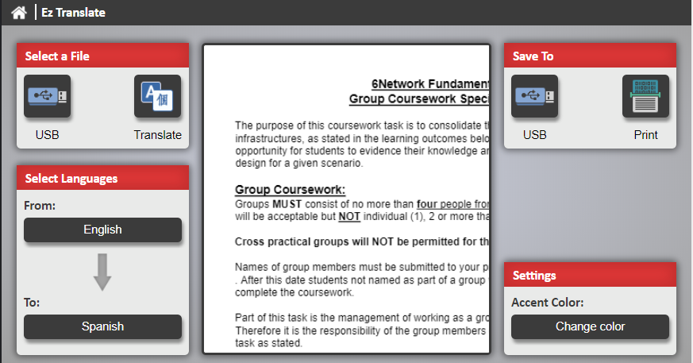
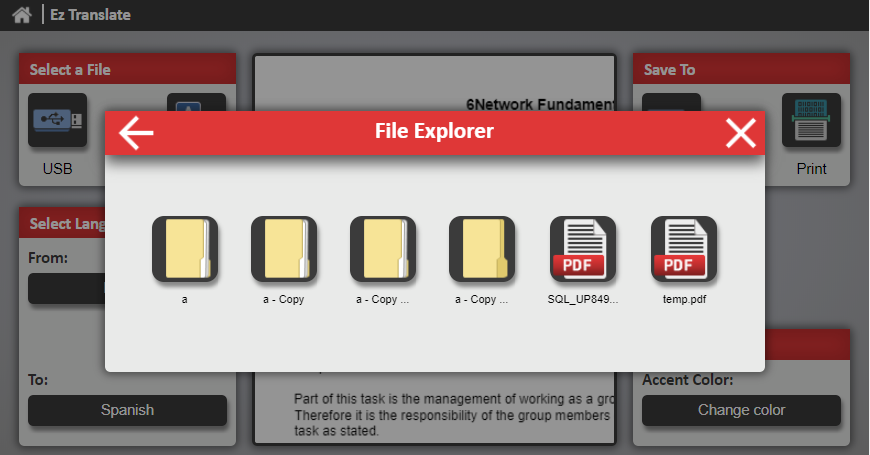
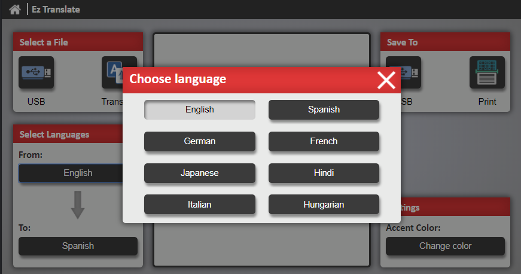
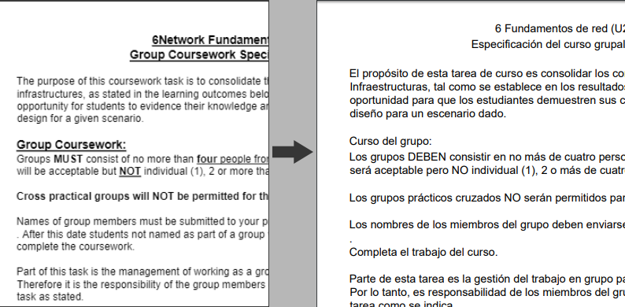

## Ez-Translate

First Prize Entry for Kyocodes 2018 April Competition held at Kyocera Document Solution UK.

We were tasked with designing and programming a application for the HyPass Multifunctional Printers. Utilizing their HyPass API.
Our application consisted of translating documents from one language to another.

Due to technical difficulties this version is not compatible with the current MFP Printers.

